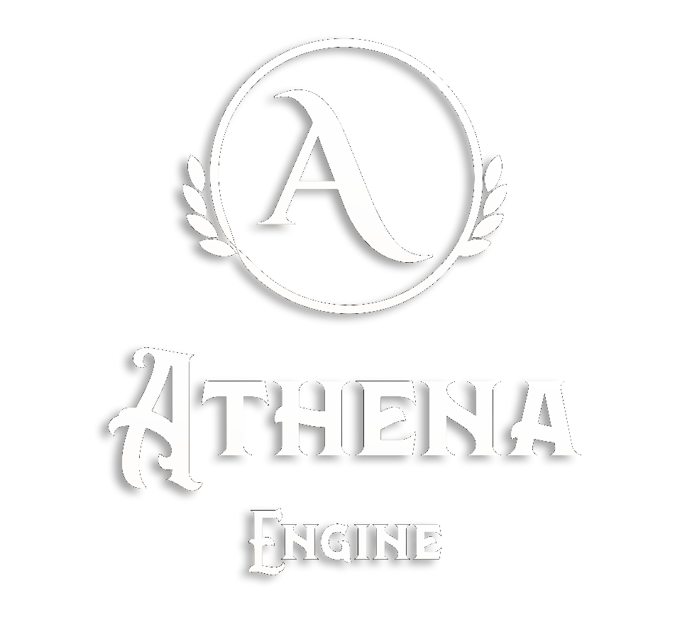

# What is Athena?
Athena is a ©2024 Roblox Library Manager and API (Application Program Interface) for Roblox Studio and its associated software. Athena is designed to seamlessly and quickly set up libraries and frameworks for applications with an explicit developer hands-on, non-user-facing interface.
The prefix "ath" is used to distinguish Athena source files. (e.g '`athClassifier.luau`').

"Maintainer" refers to the developers who use the Athena API directly to develop a library or framework.
"User" in this document refers to the players of experiences whose developers utilize a maintainer's library or framework.

# Overview of the Athena API
The Athena API is divided into several components, each of which was included in this API to facilitate the creation of fast, powerful, portable libraries that work on every platform for everyone.

The primary component of the Athena API is the athHost object. This object may be used by both maintainers and developers in order to ship and build libraries/frameworks for Roblox Studio and its associated software.

Maintainers will be interested in the athLibrary object, a psueod-format object that abstracts the library into a Luau first class object. The athLibrary object exposes many useful methods for managing and exporting information about a library, such as the constituent classes, the type information, and the singletons that make up the library's API.

Developers will utilize the athHost to build an athLibrary object, stored in any `example.ath.luau` file. This will link the library to the developers workflow and will lend them access to maintainer's libraries.

The secondary components of the Athena API are designed to make it easy to create libraries and frameworks that function on different platforms. These components are not required but their effective usage can tremendously increase quality and speed of library development.
- athTester: Provides application testing support.
- athToken: Provides application information tokens. These are immutable, small objects that signal information about the library.
- athPackage: Provides libraries with updated versions of third party dependencies.
- athInputStream: Provides libraries with powerful cross-platform user input streaming, requiring almost no work to make an accessible input platform that outperforms every other input API implementation.
- athCaller: Provides libraries with function and library safety, when error handling is of dire importance. Additionally, provides RPC support and sanity information.
- athBench: Provides libraries with the ability to diagnose performance issues and regulate networking.
- athAccountant: Provides libraries with insight into the library's large-scale performance.

# Athena Mobile Button Implementation
The following documentation describes the goals and behavior of the Athena Mobile Button implementation.

1. Mobile Button Implementations should be implemented as simply as possible for maintainers.
    a. The Mobile Button Implementation should be implemented in as few lines of code as possible.
    b. The Mobile Button implementation should never demand any additional dependencies or files in the codebase.
    c. The maintainers should be able to implement-and-forget the mobile button implementation.
2. Mobile Button Implementations should sacrifice nothing in terms of user experience for users.
    a. The experience should be identical in quality to the experience on other input platforms.
3. Mobile Button Implementations should exceed or meet the standards of quality in terms of controls provided by ©Roblox Corporation.
    a. Mobile Button Implementations should never fail to immediately respond to user input.
    b. Mobile Button Implementations should return exact outputs modified by the scalar of the user input parameters (i.e how far did they drag the joystick?).
    c. Mobile Button Implementations should be performant and reliable, and style consistent with Roblox's user interface by default.
4. Mobile Button Implementations should be highly customizable and flexible for maintainers.
    a. Mobile Button Style should be entirely customizable.
    b. Mobile Button Behaviour should be maintainer exposed.
5. Mobile Button Implementations should exceed the standards of quality in terms of existing open-source mobile button implementations (i.e (ContextActionUtility)[https://devforum.roblox.com/t/source-code-contextactionutility/804187]).

## Athena MBI Checklist
- [ ] Athena MBI: Dynamically position input streaming GUI objects using a balanced priority.
- [ ] Athena MBI: Expose Organization Layers to library maintainers to automatically set up control layouts.
- [ ] Athena MBI: Expose multiple types of buttons to library maintainers to allow for powerful and expressive mobile friendly features.
- [ ] Athena MBI: 