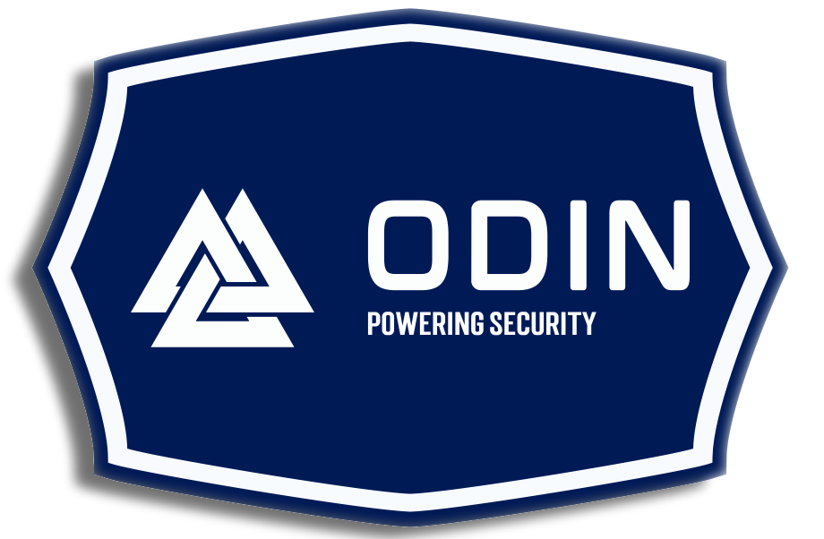

# What is Odin?
Odin is a ©2024 Roblox Anti-Cheat and Network Security Protocol API (Application Program Interface) for Roblox Studio. Odin is designed to protect your application with non-intrusive, standardized and secure techniques. A fundamental principle behind cyber security is the notion that one must never trust the client. Odin revolves around this principle, and in the world where bad actors are constantly evolving, Odin provides an additional safeguard against malicious attacks made to your experience.

Odin was written in [Luau](https://github.com/luau-lang/luau) and is designed to be implemented in pure static Luau. It is strictly typed and it is recommended that users enable the `--!strict` Luau fast flag in implementations of Odin. Additionally, to ensure that your experience is *completely* safety compliant, it is recommended that users enable the `--!optimize 2` Luau dynamic fast flag in implementation files of Odin to ensure that code functions exactly as it would in production environments.

# Overview of the Odin API
The Odin API is a minimalist implementation, with it only providing the necessary objects for modern experience network security. Today, developers enjoy the overview of Byfron, Roblox's proprietary anti-cheat which has been highly popular and effective at reducing the total number of exploits within experiences on Roblox. However, there are still holes in the wall.

# Odin Watchdog API
To run real time experience anti-cheat detection, Odin provides a very simple object stored in `odWatchdog.luau`. The odWatchdog object is a singleton that should be introduced at runtime to your experience's server. It integrates with [Heimdall](https://github.com/include-marcy/Heimdall) especially seamlessly, providing protection to the following possible exploits:
1. Movement Exploits: odWatchdog can analyze the current state of all players in real time and determine whenever a user has potentially moved their character using some kind of movement exploit.
2. Out-of-bounds Exploits: odWatchdog can be configured to prevent players from reaching certain locations, or forcing them to be contained within certain regions.
3. Automated anti-flight: odWatchdog can be configured to detect airborne agents and ground them within a certain time limit.
4. Farming and Botting Exploits: odWatchdog can flag down potentially suspicious inputs, alerting your experience about users who might be engaging in botting or other malicious activity.
5. Filtering and Safety: odWatchdog **always uses the latest Roblox filtering tools available to filter an experience** and provide optimal safety to its users. However, developers can also use odWatchdog and configure it to extend the Roblox filtering API, allowing a list of banned words, characters, and more configurable features to outsource further safety to developers.
6. In addition to the above filtering functionality, odWatchdog allows developers to configure avatar safety configurations for blacklisting certain combinations of accessories, clothes ids, clothes creators, and more.
7. Moderation Tools: Finally, odWatchdog provides developers a way to configure and enable various moderation tools, such as:
    - Voice Mute: Mute a user for a set time, or indefinitely. Their mic may appear enabled but no sound will be emitted.
    - Voice Suppression: Allow a user the ability to speak over all other voices.
    - Local Filtering: Enable filtered words and chat expressions in a single live experience server.
    - Local Spectating: Enable a custom camera mode that allows moderators to observe any actor.

# Odin Remote Security API
To ensure absolute safety, Odin should be utilized to perform sanitization and validation on all incoming tokens submitted by clients serving your game servers. For this sake, Odin provides two objects, for two use cases.
1. `odSanitizer.luau` - The odSanitizer object which contains methods to sanitize "hot" arguments the moment they reach your servers.
2. `odValidator.luau` - The odValidator object which contains methods to validate Luau data types and catch malignant data before it enters the cloud.

Each of these objects provides equally valid use cases in two equally important moments of your experience.
To implement them, you need to wrap remote and cloud API calls into the respective Odin objects. They will internally run various operations known as `Layers` on the arguments to the API or RFC, returning a [Promise](https://github.com/evaera/roblox-lua-promise).

## odSanitizer and the Remote Boundary
The Remote Boundary is the boundary between your users and the game servers. RFC (Remote function call) objects (RemoteEvent, UnreliableRemoteEvent, RemoteFunction, etc.) are used to to cross the remote boundary.

odSanitizer is designed to protect and gatekeep the flow of information across the Remote Boundary.

While receiving any argument from the client, it is important to sanitize the arguments:
1. odSanitizer allows you to reject differences in the types of data your servers expect and the types of data a client has sent.
2. odSanitizer allows you to reject logical fallacies made in the arguments sent by a client through a remote boundary.
3. odSanitizer allows you to invoke RFCs like a RemoteFunction to a client safely. It provides a static wrapper that allows you to handle edge cases in RFCs where the client doesn't respond or attempts to seize a server.

## odValidator and the Cloud Boundary
The Cloud Boundary is the boundary between your experience's servers and the cloud⏤ Any HTTP or remote Roblox API like DataStoreService, MemoryStoreService, etc.

odValidator is designed to protect and gatekeep the flow of information across the Cloud Boundary.

When your experience is going to submit some data to the cloud, it is important that the data your experience is about to submit is packaged safely and won't undergo any of these edge cases:
1. Invalid strings. Bad actors will purposefully inject invalid types of data such as non utf8 characters.
2. NaN values. Saving NaN values to the cloud is a bad practice, and could introduce vulnerabilities into your experience.
3. Unsanitized arguments. Saving unsanitized client arguments introduces contaminated data into your system, potentially opening up a host of vulnerabilities. odSanitizer is designed to potentially protect against these, but odValidator is designed to guarantee that no such value will pass the Cloud Boundary.
4. Client induced API overconsumption. Bad actors may attempt attacks on your experience where they abuse developer-created vulnerabilities in the remote boundary that attempt to overflow your experiences (or an experience server) access to the cloud boundary. odValidator protects against this by providing rate limiting software.

## Developer Extensions API
All of the listed behaviors are undesirable, and are each protected natively with two internal object: `odValidationLayer`s and `odSanitizationLayer`s. Developers and maintainers are allowed and encouraged to supplement their own `odValidationLayer`/`odSanitizationLayer` implementations as well, weaving them into either the Remote Boundary or the Cloud Boundary.
Needs of Roblox experiences are diverse, and when it comes to the unique needs of your experience, you know best. Odin facilitates and prioritizes general safety and optimal wellbeing of an experience, but extending Odin's native protection with odValidationLayers is hands-down the strongest possible form of cybersecurity your experience can attain in 2024.

To create a new odValidationLayer, you can access the odValidator object and call the constructor `odValidator:odMakeValidationLayer(odValidationLayerCreateInfo : odTypes.odValidationLayerCreateInfo)`. This will return a new `odValidationLayer`.
The process is the same for an `odSanitizationLayer`, but with the `odSanitizer`.

The `odValidationLayer` contains several features:
1. `odValidateCallback()` method which is called at this validation layer's priority in the validation pipeline.
2. `odSenseArgs()` method which is called whenever some data was passed to this `odBoundary`. This differs from the odValidateCallback because it always runs when data is passed, but odValidateCallback can sometimes not run if a previous validation callback has returned false.
3. `priority` member that defines this validation layer's priority in the validation pipeline.

The `odSanitizationLayer` contains the above properties but renamed respectively. It functions in much the same way.

# Administrator Panel API
Finally, the last component of Odin, the Administrator Panel. This is a GUI (Graphical User Interface) provided natively to anyone who installs Odin into Roblox Studio. It will generate for all users, and can be natively opened with `⌘ + K` on macOS and `alt + K` on Windows.